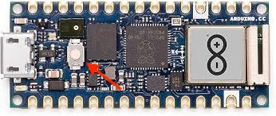
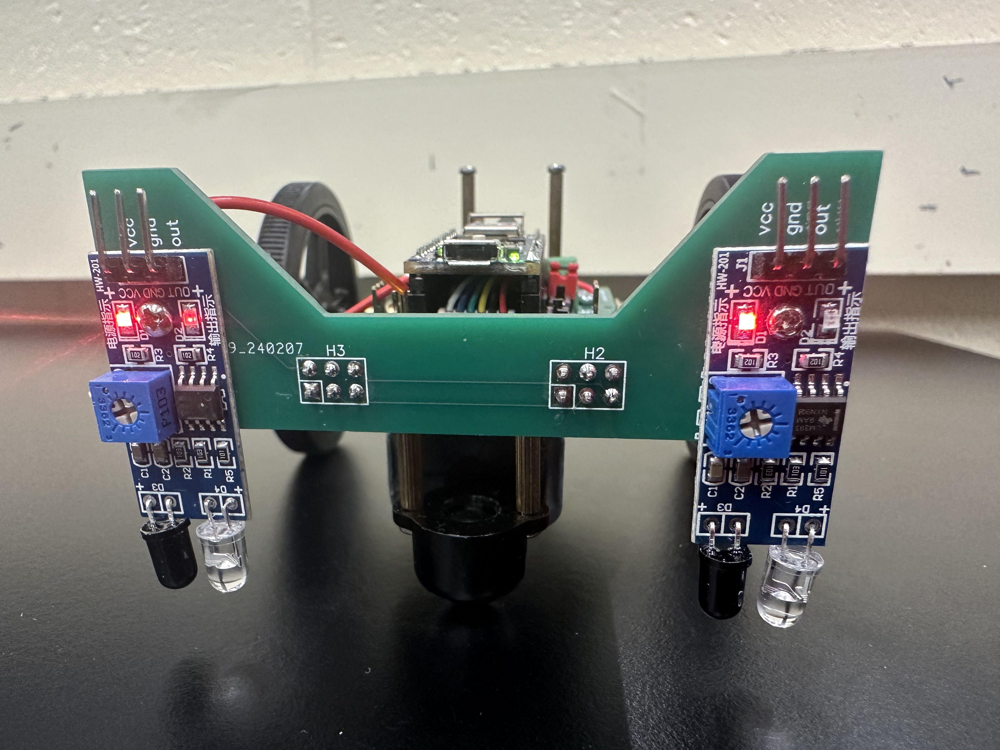

FAQ
===

No questions yet.

Troubleshooting
===============

Why are the wheels of my robot spinning at full speed after I stop my program?
-------------------------------------------------------------------------------

This behavior is expected because of `how Pulse Width Modulation (PWM) works <https://learn.sparkfun.com/tutorials/pulse-width-modulation/all>`_. If you stop your program with your motors on at any speed, there is a chance that the program will terminate with your motor spinning HIGH. The Arduino will continue its last instruction, making the motor spin at full speed until the next time you run code. To avoid this, call ``robot.stop()`` before the program ends, or flip the "Driver Enable" switch off to disable the motor hardware (remember to turn it back on when you want to spin the motors again!).

Arduino not connecting to Arduino Lab for MicroPython
-----------------------------------------------------

If your Arduino is not connecting to Arduino Lab, it's likely because your board is in the wrong mode. To fix this, single-press the white button on the top of the Arduino board:

If this doesn't work, it's probably because your code has a frequently repeating while loop which keeps the Arduino occupied. You can fix this by double-pressing the white button on top of the Arduino board. This will put the Arduino into bootloader mode, allowing you to connect to it and upload new code.

If you still cannot get the Arduino to connect, it could be a problem on your computer. Try changing the port you're using to connect to the Arduino.

IR sensor has both LEDs lit regardless of sensor state
------------------------------------------------------

We've noticed a problem with some of the boards where the right IR sensor has both LEDs on, regardless of whether the sensor is in front of a white or black surface:

If you're noticing this, add

.. code-block:: python

    from machine import Pin

to your import statements and add the line

.. code-block:: python

    Pin(28, Pin.OUT).on()

after your imports and before ``robot = NanoBot()``.

I connected once over Bluetooth, but now I can't connect again!
---------------------------------------------------------------

Run your code with the Arduino connected to your laptop to ensure that your code has no errors. Often, if you connect to Bluetooth first, your code may have a syntax error which prevents the Arduino from running it.

If you still can't find your Arduino on your mobile device and there are no errors running the code, your Arduino may have automatically been renamed. We've noticed this commonly on LightBlue on iOS, where the Arduino may be renamed to names such as "MPY NIMBLE", "RP2040 CONNECT", and others. If you can't find your Arduino via search, try scrolling through nearby peripherals and look for a name that could be your Arduino. If you think you found it, connect to the device and click "Advertisement Data". Here, you should see a local name which would be the name you expected it to advertise at (e.g. "NanoNav" in our test code). If you see the name matches what you'd expect, you've found your Arduino.

Strange problems with code which was just working
-------------------------------------------------

If when running in solo mode, the Arduino behaves strangely when running code which you know works, it could be because you are out of storage. This will not happen until your code files are at least 30 KB in total!!! If your code files are not 30 KB or larger in total, what you're experiencing is an ordinary bug. If you suspect that you make be out of storage, try to shrink your code by removing comments and making functions more efficient. Every character counts, because it's the storage of your .py files which is running out. Try removing excess newlines or whitespace.

Issues
------

Found a bug? Create an issue on GitHub. Submit `here <https://github.com/Bram-Hub/NanoNav/issues>`_ with as much information as you can provide
about the context of the bug.
