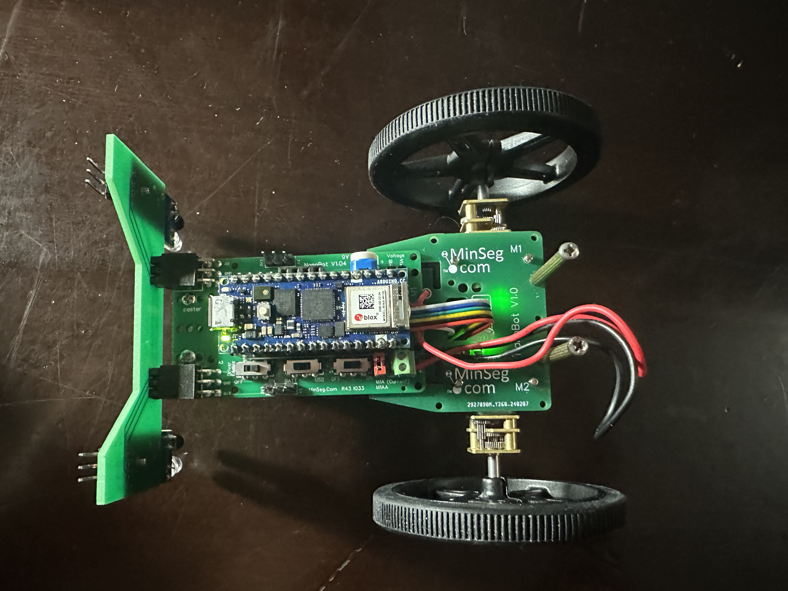

Quick Start
===========

Assembly
--------

.. image:: images/parts.jpeg
   :height: 200
   :alt: Kit parts

The kit has 5 main parts: the IR sensor bar, Arduino Nano RP2040, wheels, battery (not shown), and MinSeg board. To assemble:

1. Insert the battery into the MinSeg kit. This could be a tight fit, so be careful! Line up the terminals first, then rock the battery into place.

2. Place the Arduino Nano RP2040 on top of the MinSeg kit. Each pin on the Arduino aligns with a connector on the MinSeg kit. Make sure the microUSB connector is facing forwards.

3. Slide the IR sensor bar into the front of the MinSeg board with the IR sensors facing downwards. Correct orientation is crucial to avoid reversing polarity and burning out the LEDs.

.. image:: images/IR_assembled.jpeg
   :height: 200
   :alt: The IR sensors inserted properly.

4. Slide the wheels onto the motor shafts. Align the flat side of the wheel with the flat side of the motor shaft. If needed, orient the outward bump as shown below:

.. image:: images/wheels.jpeg
   :height: 200
   :alt: The motors and wheels.

5. Check the three switches on the left side of the MinSeg board: "Pwr Switch", "Driver Volts", and "Driver Enable".
   - Flip the **Power Switch** on. Lights should appear on the Arduino, MinSeg board, and IR sensors.
   - Flip **Driver Enable** to ON to allow the Arduino to drive the motors.
   - Set **Driver Volts** to Battery Power to use the battery instead of your laptop.

With this, your kit is ready to go!

Installation
------------

1. Download **Arduino Lab for MicroPython**: `Arduino Lab for MicroPython <https://labs.arduino.cc/en/labs/micropython>`_. This is the environment for transferring MicroPython code to the Arduino.

2. Install a **Bluetooth Low Energy (BLE) scanning app** on your mobile device. Recommended apps: **BLE Scanner** or **LightBlue**.

3. Download the NanoNav starter code: :download:`nanonav_starter.zip </../../tests/installation_check/nanonav_starter.zip>`. Extract the files, including `nanonav.py` and `ble_advertising.py`.

The `ble_advertising.py` file comes from MicroPython's GitHub repository: `MicroPython BLE <https://github.com/micropython/micropython/tree/master>`_.

Workflow Using Arduino Lab for MicroPython
------------------------------------------

1. Create a folder for your MicroPython code. Include `nanonav.py`, `ble_advertising.py`, and `main.py`.

2. Open **Arduino Lab for MicroPython**. Use **File → Open** to open `main.py`.

Connecting to the Arduino over USB
^^^^^^^^^^^^^^^^^^^^^^^^^^^^^^^^^^

1. Connect your Arduino to your computer via USB.
2. In Arduino Lab, click the **Connect** button (top left).
3. If prompted to update firmware, click **OK**. If you see an error about failing to connect, toggle the mode on the board by single-pressing the small white button on top of the Arduino (see `Troubleshooting <https://bram-hub.github.io/NanoNav/faq.html#troubleshooting>`_ for more details).
4. Once connected, your Arduino will appear as an external drive (Windows Explorer, Mac Finder, etc.), typically named "NO NAME" or "USB Drive".

.. note::
   Copy the files from the starter folder **directly** to the Arduino drive (not the folder itself).

Running Your Code
^^^^^^^^^^^^^^^^^

You have two options:

**Laptop Mode**: Early stages
- Keep the Arduino connected to the computer.
- Click **Run** in Arduino Lab.
- You can debug using print statements in the Console.

**Solo Mode**: After initial testing
- Copy `main.py` to the Arduino drive via File Explorer or Finder.
- Arduino will run the code independently of the laptop (unplug USB).
- No Console output is available in solo mode.

Running the Test Code
^^^^^^^^^^^^^^^^^^^^^

Use the `main.py`, `nanonav.py`, and `ble_advertising.py` from the starter zip to verify your Arduino:

You should have copied the files to the Arduino drive. Now, run the code in **Laptop Mode** by clicking **Run** in Arduino Lab while you have the `main.py` file open and the Arduino connected via USB.
- The wheels should spin forward and backward.
- The Serial Monitor should display encoder values.
- Using your phone's BLE scanner, find a peripheral named "NanoNav" or "MPY Nimble". Write a character to the characteristic; the Console should display the ascii value of the character you sent, then send IR sensor values.

If everything works, your kit is functional. Otherwise, check the `Troubleshooting <https://bram-hub.github.io/NanoNav/faq.html#troubleshooting>`_ guide.

MicroPython
-----------

- MicroPython is similar to Python, but some standard libraries may not be available.
- You can import modules like `time`, but not `Queue` or some PyPi packages.
- Helper functions are provided for Arduino, BLE, and peripheral control.
- Documentation: `MicroPython Docs <https://docs.micropython.org/en/latest/>`_

Next Steps
----------

Now that your Arduino is running MicroPython, you can start coding:

- Modify `main.py` to experiment with the `nanonav` library.
- Explore guides for using **Bluetooth**, controlling **Movement**, and reading **Sensors**.
