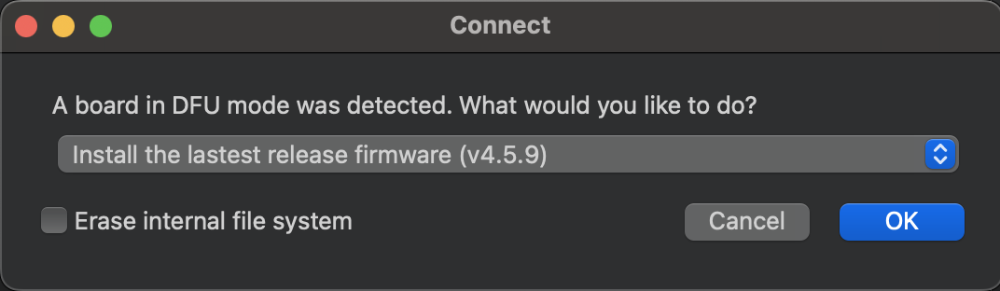
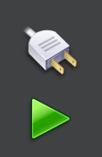
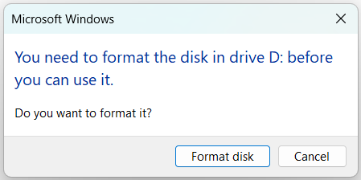

Quick Start
===========

Assembly
--------

.. image:: images/parts.jpeg
   :height: 200
   :alt: Kit parts

The kit has 5 main parts: the IR sensor bar, Arduino Nano RP2040, wheels, battery (not shown) and MinSeg board. To assemble, insert the battery into the MinSeg kit. This could be a tight fit, so be careful! Line up the terminals of the battery first (they should connect together well), then rock the battery into place.

Next, insert the Arduino on the top of the MinSeg kit. Each pin on the Arduino has a corresponding connector on the MinSeg kit, so make sure they align. The Arduino should be oriented as shown, with the microUSB connector facing forwards on the kit.

Next, slide the IR sensor bar into the front of the MinSeg board, with the IR sensors facing downwards. The orientation is important so that you do not reverse polarity and burn out the LEDs!

.. image:: images/IR_assembled.jpeg
   :height: 200
   :alt: The IR sensors inserted properly.

After that, slide the wheels onto the motor shafts. Be gentle! The wheels and motor shafts have a flat side (D shafts), so make sure the flats align before trying to slide them on! If you have trouble, try facing the outwards bump of the wheels into the kit as shown below:

.. image:: images/wheels.jpeg
   :height: 200
   :alt: The motors and wheels.

After that, the kit is assembled. Let's adjust the settings. On the left side of the MinSeg board, you'll find three switches, labeled "Pwr Switch", "Driver Volts", and "Driver Enable". When you flip the Power Switch on, you should see lights on the Arduino, MinSeg board, and IR sensors light up. If any of these lights do not light up, something is wrong with your assembly. Make sure you have done the previous steps correctly, including inserting a battery.

Flipping the Driver Enable switch will allow the Arduino to drive the motors. Switch it to ON.

Lastly, flip "Driver Volts" to Battery Power. This will draw power from the battery rather than your laptop (which will be disconnected when you run your final code).

With this assembly and settings, you'll be ready to go!

Installation
------------
You will need to download `OpenMV IDE <https://openmv.io/pages/download>`_ to transfer your MicroPython code onto the arduino. See :ref:`Workflow` for more information about this process.

You will also need to install LightBlue on your mobile device for Bluetooth communication. You can download it from the App Store or Google Play Store.

Your Arduino Nano RP2040 can run either C++ or MicroPython, but not both at the same time. So before moving on, it is important that the Arduino is configured for MicroPython mode.
`This guide <https://docs.arduino.cc/tutorials/nano-rp2040-connect/rp2040-openmv-setup/>`_ from Arduino will walk you through the process of "bootloading" the Nano RP2040 so that 
you can run MicroPython code on it. After you have done this once, you should not need to do it again.

To use the NanoNav supplementary code, download this starter zip folder :download:`nanonav_starter.zip </../../tests/installation_check/nanonav_starter.zip>`.
You will need the `nanonav.py` file as well as the `ble_advertising.py` file for any projects you use NanoNav with. Extract the files from the zip folder; you will use them for the next steps.

The `ble_advertising.py` file comes from `MicroPython's github repository <https://github.com/micropython/micropython/tree/master>`_. If you're interested, you can check out the latest Open Source developments in MicroPython!
   
..  _Workflow:

Workflow Using OpenMV
---------------------

Here is how you can program your Arduino. You will need a file called `main.py` that contains your MicroPython code - you can create other files 
and import them as usual, but `main.py` is the one that will be run on the Arduino. We'll explain a bit more about :ref:`MicroPython` below. 
For getting started quickly, we provide a test `main.py` file in the starter zip folder so you can veify everything is working.

We recommend creating a folder that you will use for your MicroPython code - put each of `nanonav.py`, `ble_advertising.py`, `main.py` in that folder. 
Open the OpenMV IDE application. Use the File -> Open Files menu to select the `main.py` file that you downloaded.

Connecting to the Arduino over USB
^^^^^^^^^^^^^^^^^^^^^^^^^^^^^^^^^^

Connect your Arduino to your computer using a USB cable. 

In the bottom left of the OpenMV IDE, you should see this:

.. image:: images/openmv_unconnected.png
   :height: 100
   :alt: OpenMV unconnected symbols

If you don't see this, it means that OpenMV doesn't recognize the board. 
You can wait for a little and try messing with your USB conection (different cable, different port, unplug/replug, etc.).

If this still does not work, `try putting the Arduino in bootloader mode <https://bram-hub.github.io/NanoNav/faq.html#arduino-not-connecting-to-openmv>`_.

Once you see the "Connect" button, click it (the USB connection, or upper button of the two in the image).

When you try to connect, you may see a popup requesting to load the latest firmware. If you see this, click OK.

The arrow below it should turn green when connected.

When the Arduino is connected (as indicated by the green arrow), you should be able to find the Arduino as an external drive in FileExplorer (Windows), Finder (Mac), 
or the equivalent for your Operating System. 
It will likely be named "NO NAME" or "USB Drive" and should contain a `main.py` and `README.txt` file. 

When you open the drive on your computer, it may ask you to reformat the drive. If so, select "Format Disk".

.. note::
   You must copy the the files (not the folder) from :download:`nanonav_starter.zip </../../tests/installation_check/nanonav_starter.zip>` 
   over to the Arduino (external drive) by either Ctrl-C Ctrl-V or drag-and-drop. 
   This will enable you to import nanonav when you run your code on the board.

Running your code on the Arduino
^^^^^^^^^^^^^^^^^^^^^^^^^^^^^^^^

You have two options for running your code on the Arduino: laptop mode and solo mode.

**Laptop mode**: Click the arrow to run the code in conjunction with the laptop. Running in laptop mode is optimal for debugging. You can run and stop your code without touching the Arduino or USB cable. While in laptop mode, you can use print statements to print to the Serial Terminal in the OpenMV IDE. You can expand this terminal by pressing its corresponding button in the bottom left of the IDE. Note that when running in laptop mode, you must have the Arduino connected to the laptop. Once you disconnect the Arduino, your code will no longer be running.

**Solo mode**: To run code without the laptop connected, you need to run in solo mode. Connect to the Arduino but don't hit the green play. Instead, go to Tools > Save open script to OpenMV Cam (as main.py). This will write the file you have open to the Arduino under the name "main.py". An alternative way to do this would be to copy the file over in FileExplorer/Finder like we did for the starter files. If you copy the file using FileExplorer/Finder, make sure it's named main.py, as the Arduino looks for and executes only the main.py file. In solo mode, you won't have access to any print statements or Python exceptions, so only use solo mode after you've tested your code in laptop mode.

We recognize that OpenMV IDE is not a very nice editor to write code in, so feel free to open `main.py` in your favorite editor (such as VS Code) for editing and run it from OpenMV IDE.

..  _MicroPython:

Running our test code
^^^^^^^^^^^^^^^^^^^^^

When you have doubts about whether your Arduino is functioning properly, try running our test code! Use the `main.py`, `nanonav.py`, and `ble_advertising.py` files from :download:`nanonav_starter.zip </../../tests/installation_check/nanonav_starter.zip>`.

This tests all of the features of the kit: motors, encoders, IR sensors and Bluetooth.

When you run it, you should see the wheels spin forwards first, then backwards after a few seconds. On the Serial Terminal in the OpenMV IDE, you should see the encoder values printed out.

Using your phone, look on LightBlue for a peripheral named something related to Arduino (names may vary). Some examples are: "NanoNav", "Arduino", "MPY Nimble", etc. See `Connecting from Mobile <https://bram-hub.github.io/NanoNav/bluetooth.html#connecting-from-mobile>`_ for more detailed information. Connect to the peripheral and write 0 to the Read/Write characteristic. You should see 0 printed on the Serial Terminal.

After writing over Bluetooth, the IR sensor values should be printed out in the Serial Terminal.

If all of this works, you've verified that your kit works correctly! If not, try our `Troubleshooting <https://bram-hub.github.io/NanoNav/faq.html#troubleshooting>`_. Happy coding!

MicroPython
-----------

In general, MicroPython is very similar to regular Python, but there are some difference we would like to point you to before you begin. MicroPython has its own library of 
packages, which are different from the PyPi packages you may be used to (if you ever ``pip install`` anything). We provide helper functions for the ways we think you'll need to 
interact with the Arduino, Bluetooth, and peripherals, and just about anything you can do in Python 3.11 can also be done in MicroPython, but note that you will not have access to the full standard Python library. For instance, you can import `time` since this has been added to
MicroPython's library, but you cannot import `Queue` or other familiar packages. If ever in doubt about whether MicroPython supports a particular package, simply google "MicroPython [package name]", 
and you will likely find the information you need.
You can find the MicroPython documentation `here <https://docs.micropython.org/en/latest/>`_.

..  _NextSteps:

Next Steps
----------

Now that you have your Arduino set up and running MicroPython, you can start writing your own code. Feel free to take a look at and modify the `main.py` we provided earlier to see a few ways of interacting with 
the Arduino using the `nanonav` library. When you are ready to learn more, take a look at our guides to using :ref:`Bluetooth`, controlling :ref:`Movement`, and reading :ref:`Sensors`.
